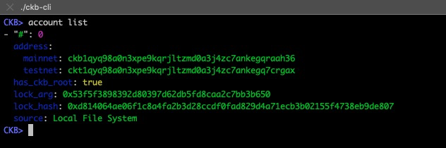
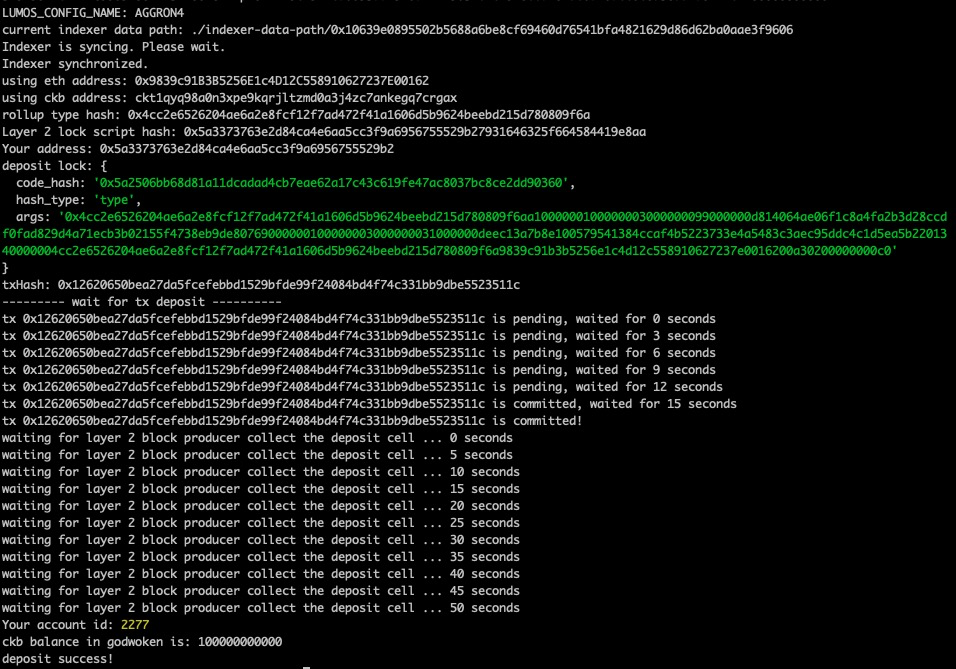

# 1. Create a Godwoken Account on the EVM Layer 2 Testnet

## Task Submission

To complete the tasks, add the following materials to a document on your Github and submit for review by the judges (include the link in your Gitcoin submission):

1. A screenshot of the accounts you created (account list) in ckb-cli.

2. A link to the Layer 1 address you funded on the Testnet Explorer.

[https://explorer.nervos.org/aggron/address/ckt1qyq98a0n3xpe9kqrjltzmd0a3j4zc7ankegq7crgax](https://explorer.nervos.org/aggron/address/ckt1qyq98a0n3xpe9kqrjltzmd0a3j4zc7ankegq7crgax)

3. A screenshot of the console output immediately after you have successfully submitted a deposit to Layer 2.

