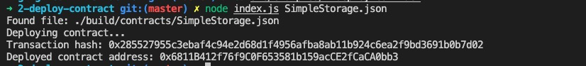

#  2. Deploy a Simple Ethereum Smart Contract on Polyjuice 


## Task Submission
To complete the tasks, add the following materials to a document on your Github and submit for review by the judges (include the link in your Gitcoin submission):

1. A screenshot of the console output immediately after you have successfully deployed a smart contract.



2. The transaction hash from the contract deployment (in text format).

```text
0x285527955c3ebaf4c94e2d68d1f4956afba8ab11b924c6ea2f9bd3691b0b7d02
```

3. The deployed contract address from the contract deployment (in text format).

```
0x6811B412f76f9C0F653581b159acCE2fCaCA0bb3
```