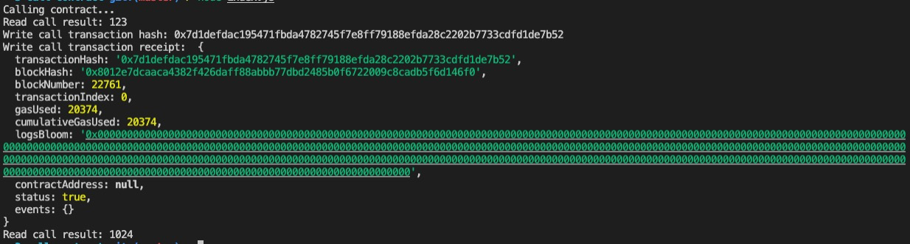

#  3. Issue a Smart Contract Call to the Deployed Smart Contract


## Task Submission
As a result of the contract call in the previous step, you should have received Transaction hash as part of the command output.

To complete the tasks, add the following materials to a document on your Github and submit for review by the judges (include the link in your Gitcoin submission):

1. A screenshot of the console output immediately after you have successfully issued a smart contract call.
    
    

2. The transaction hash from the console output (in text format).
    ```
      0x7d1defdac195471fbda4782745f7e8ff79188efda28c2202b7733cdfd1de7b52
    ```
3. The contract address that you called (in text format).
    ```
      0x6811B412f76f9C0F653581b159acCE2fCaCA0bb3
    ```
4. The ABI for contract you made a call on (in text format).
    
    ```json
      [
        {
            "inputs": [],
            "stateMutability": "payable",
            "type": "constructor"
        },
        {
            "inputs": [
                {
                    "internalType": "uint256",
                    "name": "x",
                    "type": "uint256"
                }
            ],
            "name": "set",
            "outputs": [],
            "stateMutability": "payable",
            "type": "function"
        },
        {
            "inputs": [],
            "name": "get",
            "outputs": [
                {
                    "internalType": "uint256",
                    "name": "",
                    "type": "uint256"
                }
            ],
            "stateMutability": "view",
            "type": "function"
        }
      ]
    ```