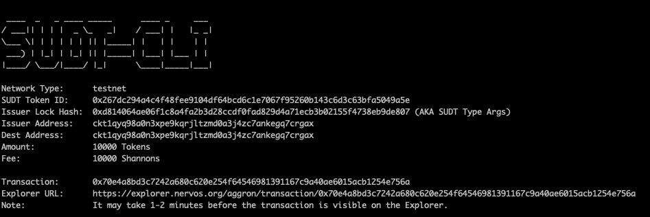
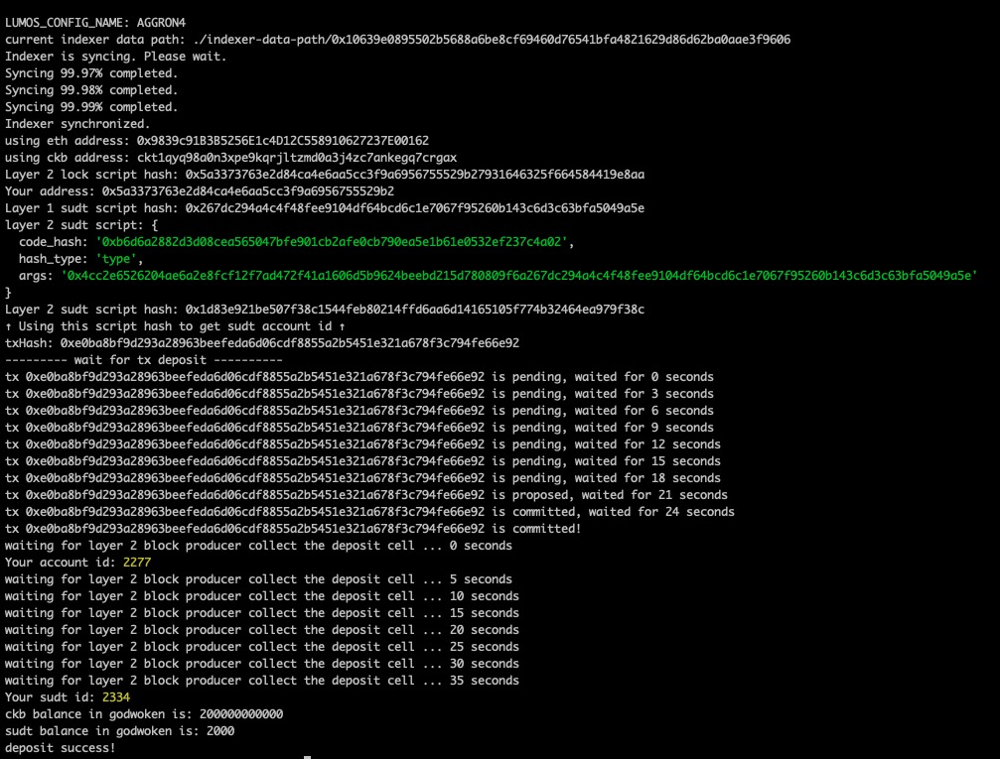

# Issue an SUDT Token on Layer 1 and Deposit it to Layer 2


## Task Submission
To complete the tasks, add the following materials to a document on your Github and submit for review by the judges (include the link in your Gitcoin submission):

1. A link to the Layer 1 address you funded on the Testnet Explorer.
   
   [https://explorer.nervos.org/aggron/address/ckt1qyq98a0n3xpe9kqrjltzmd0a3j4zc7ankegq7crgax](https://explorer.nervos.org/aggron/address/ckt1qyq98a0n3xpe9kqrjltzmd0a3j4zc7ankegq7crgax)

2. A screenshot of the console output immediately after using sudt-cli to create your SUDT tokens on Layer 1.
    
    

3. A link to the transaction ID created by sudt-cli on the Testnet Explorer.

    [https://explorer.nervos.org/aggron/transaction/0x70e4a8bd3c7242a680c620e254f64546981391167c9a40ae6015acb1254e756a](https://explorer.nervos.org/aggron/transaction/0x70e4a8bd3c7242a680c620e254f64546981391167c9a40ae6015acb1254e756a)

4. A screenshot of the console output immediately after you have successfully submitted a deposit to Layer 2 using the account-cli tool.
      
      

5. The SUDT ID from the console output after executing the deposit script (in text format).
    ```
      2334
    ```

