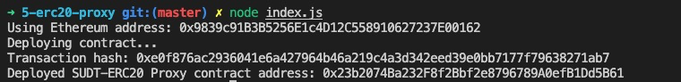
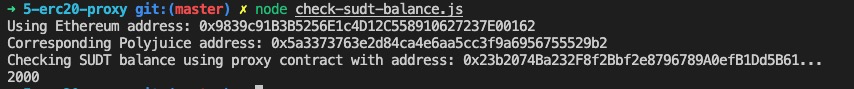

# 5. Deploy the ERC20 Proxy Contract for the Deposited SUDT

## Task Submission

1. A screenshot of the console output immediately after deploying smart contract.
   

2. The address of the ERC20 Proxy Contract you deployed (in text format).

  ```
    0x23b2074Ba232F8f2Bbf2e8796789A0efB1Dd5B61
  ```
3. A screenshot of the console output immediately after checking your SUDT balance.
   
   

4. The Ethereum address that was checked (in text format).
    
    ```
      0x9839c91B3B5256E1c4D12C558910627237E00162
    ```


