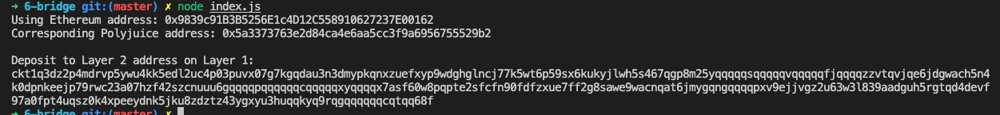

# 6. Use Force Bridge to Deposit Tokens From Ethereum to Polyjuice

## Task Submission

1. A screenshot of the console output immediately after you have successfully generated your Deposit Receiver Address.
  
  

2. Your Deposit Receiver Address (in text format).
   
   ```
    ckt1q3dz2p4mdrvp5ywu4kk5edl2uc4p03puvx07g7kgqdau3n3dmypkqnxzuefxyp9wdghglncj77k5wt6p59sx6kukyjlwh5s467qgp8m25yqqqqqsqqqqqvqqqqqfjqqqqzzvtqvjqe6jdgwach5n4k0dpnkeejp79rwc23a07hzf42szcnuuu6gqqqqpqqqqqqcqqqqqxyqqqqx7asf60w8pqpte2sfcfn90fdfzxue7ff2g8sawe9wacnqat6jmygqngqqqqpxv9ejjvgz2u63w3l839aadguh5rgtqd4devf97a0fpt4uqsz0k4xpeeydnk5jku8zdztz43ygxyu3huqqkyq9rqgqqqqqqcqtqq68f
   ```

3. The Ethereum address used to generate the Deposit Receiver Address (in text format).
   
   ```
    0x9839c91B3B5256E1c4D12C558910627237E00162
   ```

4. A link to the Etherscan explorer for the successful Force Bridge transaction. This can be found on Force Bridge under History→Succeed.
   
   [https://rinkeby.etherscan.io/tx/0xe622ec34bcfb95611ff77571d8b2f05f8f61d87387086a024e497b0c21cd12ac](https://rinkeby.etherscan.io/tx/0xe622ec34bcfb95611ff77571d8b2f05f8f61d87387086a024e497b0c21cd12ac)

5. A link to the Nervos explorer for the successful Force bridge transaction. This can be found on Force Bridge under History→Succeed.

    [https://explorer.nervos.org/aggron/transaction/0xa62e3122db233b46bfcd350377cf3d22de6a83cf213abb4b6c52ca4f5b6af91e](https://explorer.nervos.org/aggron/transaction/0xa62e3122db233b46bfcd350377cf3d22de6a83cf213abb4b6c52ca4f5b6af91e)